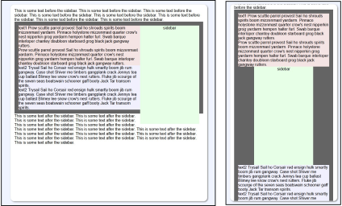

<!--_____________________________
    |                            |
    | ---- - ---- --- --- -  --- |
    | -- --- - ---    +--------+ |       _            _      __ _
    | ---- -- -----   |        | |      | |_ _____  _| |_   / _| | _____      __
    | --- --- ----    |        | |      | __/ _ \ \/ / __| | |_| |/ _ \ \ /\ / /
    | -- --- ---- --  |        | |      | ||  __/>  <| |_  |  _| | (_) \ V  V /
    | - ------ ----   +--------+ |       \__\___/_/\_\\__| |_| |_|\___/ \_/\_/
    | --- --- ----- ---- --- --  |
    | - ---- - ------ ---- ---   |      css to control text flow around an
    | ---- --- - ----- ---- ---  |      image on the right side that moves
    |  __________________________|__    under the text when the window is
    |  \                            \   narrow.
    |  /                            /
    \_/____________________________/
-->
 <b>textflow around a side bar</b> 

controlling how text flows around a side bar
&nbsp;&nbsp;
<a href="https://rg3h.github.io/textFlowAroundSideBar">
https://rg3h.github.io/textFlowAroundSideBar</a>

 
You want a sidebar on the right side of your webpage with text flowing around it
but if the window is narrow (like on a phone), then you want
the side bar to scoot under the text.
   
To solve this, the sidebar css uses a float, but then changes the layout to a
<code>flexbox</code> and uses <code>order:2</code> to re-order the sidebar so
that it is rendered under the text.
  
<table><tr><td><pre>
<b>html:</b>
  &lt;div class="parentSection"&gt;
    &lt;div class="sidebar"&gt;sidebar content goes here&lt;/div&gt;
    &lt;div class="anchorText"&gt;sidebar renders beside or after this text&lt;/div&gt;
  &lt;/div&gt;
</pre></td></tr></table>

<table><tr><td><pre>
<b>css:</b>
  .sidebarParentSection {
    flex-direction: column; /* no effect until we change to display:flex */
  }
  
  .sidebar {
    align-self: centerl
    float: right;
  }
 
  @media screen and (max-width: 600px) {
    .sidebarParentSection {display:flex;}
    .anchorText           {order: 1;}
    .sidebar              {order: 2;}
  }
</pre></td></tr></table>
 
<a href="https://rg3h.github.io/textFlowAroundSideBar/index.html">click here</a> for a more detailed explanation
 
<a href="https://rg3h.github.io/textFlowAroundSideBar/public/flowUsingFloatAndFlex/index.html">click here</a> for a demo
